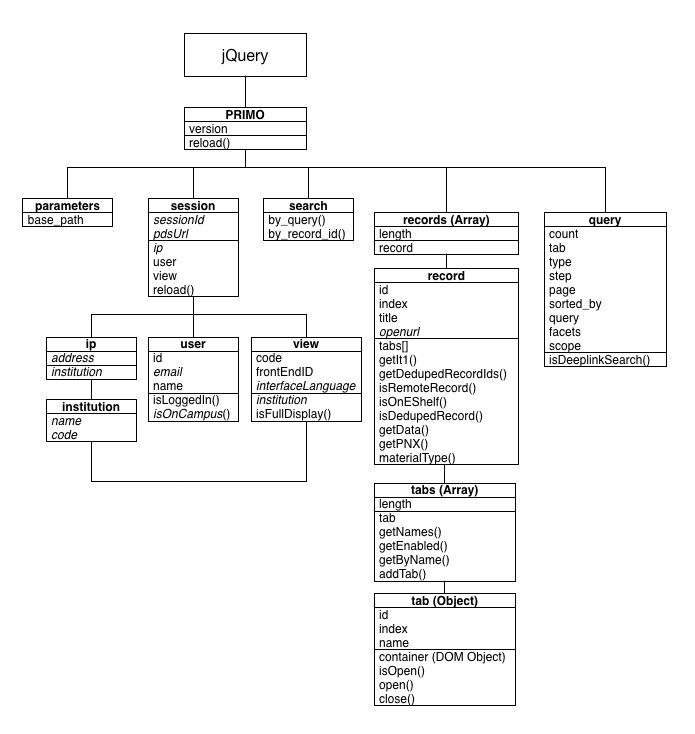

jQuery.PRIMO
============

A client side convenience library for PRIMO v4.6 and better. 
This is a work in progress. This might not work for you at all but if more people use it the better it will get. 
If you want a feature, have a comment, found a bug or just want to talk ping me.  

See the [releases](https://github.com/mehmetc/jQuery.PRIMO/releases) for downloads and release notes


Installation  (TODO)
------------

### Just for testing
You can inject the script into your results page, for testing. This works best using Firefox.
Open the JavaScript console and paste the next line. You will not be able to use the more advanced functions 
but it should give you an idea of what it can be used for.
```js
    $.getScript('https://raw.githubusercontent.com/mehmetc/jQuery.PRIMO/master/dist/jqprimo/jquery.PRIMO.js')
``` 
Browsers are getting stricter with every release. If you get strange errors just copy the complete source into your console.    
    
### A permanent solution
#### You have shell access
- Copy the contents of the dist/* directory to fe_web
```bash
    scp dist/* primo@my_primo.example.com:/exlibris/primo/p4_1/ng/primo/home/system/tomcat/search/webapps/primo_library?libweb
```    
- Add jquery.PRIMO.min.js to **static_htmls/footer.html** or to a custom tile and add the snippet below to it
```js    
    <script type='text/javascript' src='/primo_library/libweb/jqprimo/jquery.PRIMO.min.js'></script>
```    

#### You do not have shell access
If you do not have shell access to your server you can ask ExLibris to upload these. 
or if you do not need any functionality provided by helper jsp's you can only upload the library with the Primo File Uploader functionality.
The video below gives a short explenation on how to install jQuery.PRIMO.js on a hosted SAAS environment.

 [](https://vimeo.com/145251116)
 
We are working closely with ExLibris to make this a part of Primo. 

The helper files will add extra functionality to the library like looking up records id in a deduped record, get the original record, ...

Compilation  (TODO)
-----------
If you would want to compile jquery.PRIMO.js then follow these steps
- Install [npm](http://nodejs.org/) and [gulp](http://gulpjs.com/)
- `npm install`
- `gulp`

#Object model


#Examples  
- [Use templates and keep your sanity](#templates)     
     
###### Objects             
- [misc](#misc)  
- [session](#session)
- [query](#query)
- [facets](#facets)
- [records](#records)
- [search](#search)  
  
##**MISC**<a name="misc"></a>  
#### Version of jQuery.PRIMO library
```js
    jQuery.PRIMO.version;
```

#### Reload jQuery.PRIMO
```js
    jQuery.PRIMO.reload();
```


##**SESSION**<a name="session"></a>
Some functions and attributes will only be available when the _remote_session_data_helper.jsp_ file is installed on the server.
Otherwise it will load a minimal of session data from the default _getUserInfoServlet_ service.
    
_**In other words if you can not find the attribute or function you are looking for see if the helper methods are getting loaded.**_
    

- [user](#user)
- [view](#view)
- [ip](#ip)
- [pds](#pds)
- [performance](#performance)

#### Get the session id
```js
    jQuery.PRIMO.session.sessionId;
```

#### Reload session data
```js
    jQuery.PRIMO.session.reload();
```

###**USER**<a name="user"></a>
#### Read the current sessions user id
```js
    jQuery.PRIMO.session.user.id;    
```

#### Read the current session user name
```js
    jQuery.PRIMO.session.user.name;            
```

#### Read the current session user email
```js
    jQuery.PRIMO.session.user.email;            
```

#### Check if the current user is logged in
```js
    jQuery.PRIMO.session.user.isLoggedIn();    
```

#### Check if the current user is on campus
```js
    jQuery.PRIMO.session.user.isOnCampus();    
```

#### Get the Personalized Ranking Categories
```js
    jQuery.PRIMO.session.user.ranking.categories;
```

#### Get the Personalized Ranking 'Prefer newer material' value
```js
    jQuery.PRIMO.session.user.ranking.prefer_new;
```

###**VIEW**<a name="view"></a>
#### Get the current view code
```js
    jQuery.PRIMO.session.view.code;
```

#### Get the current view's institution name
```js
    jQuery.PRIMO.session.view.institution.name;
```  

#### Get the current view's institution code
```js
    jQuery.PRIMO.session.view.institution.code;
```  

#### Get the current view's interface language
```js
    jQuery.PRIMO.session.view.interfaceLanguage;
```  

#### Is the current view in full display mode
```js
    jQuery.PRIMO.session.view.isFullDisplay();    
```

#### Get the current view frontend id
The file:
```
  jqprimo/helpers/frontend_id
```
should contain a marker for the frontend where jQuery.PRIMO is installed.
For example:
    staging or test or 1 or ...

Then you can get the frontend id this can be handy when you are debugging

```js
    jQuery.PRIMO.session.view.frontEndID;    
```

###**IP**<a name="ip"></a>

####Get IP address as seen on PRIMO
```js
    jQuery.PRIMO.session.ip.address;
```

####Get institution name by IP 
```js
    jQuery.PRIMO.session.ip.institution.name;
```

####Get institution code by IP 
```js
    jQuery.PRIMO.session.ip.institution.code;
```    

##**PDS**<a name="pds"></a>

If you want this to work you need to add the borrower info url to the helper file. 
Please look at _jqprimo/helpers/remote_session_date_helper.jsp_ for the instructions.

#### Get the url for PDS
```js
    jQuery.PRIMO.session.pds.url;
```

#### Get PDS Handle (only available after login)
```js
    jQuery.PRIMO.session.pds.handle;
```

### GET borrower info _Object_ from PDS. 
This uses General Configuration -> Installation -> PDS_URL to build the PDS access url 
and it returns /bor/bor-info. 
```js
    jQuery.PRIMO.session.pds.borInfo;
```

##**PERFORMANCE**<a name="performance"></a>
**Only available if the browser supports it.**
Be careful the getPageLoad and getPageRender methods are non blocking. 
This means they will _only_ return sain values after the page is completely loaded and rendered.

### Timing

#### Get timing for Network latency
```js
    jQuery.session.performance.timing.getNetworkLatency();
```

#### Get timing for Page Load
```js
    jQuery.PRIMO.session.performance.timing.getPageLoad();
```
    
#### Get timing for Page Render    
```js
    jQuery.PRIMO.session.performance.timing.getPageRender();
```
   

##**RECORDS**<a name="records"></a>
Extends the **DOM**.  

- [tabs](#tabs)

#### Get number of records on screen (this is an Array)
```js
    jQuery.PRIMO.records.length;
```

#### Get the record id of the 6th field
```js
    jQuery.PRIMO.records[5].id;    
```

#### Get the record index
```js
    jQuery.PRIMO.records[5].index;    
```

#### Get title of 6th record
```js
    jQuery.PRIMO.records[5].title;    
```

#### Get OpenUrl of 6th record
```js
    jQuery.PRIMO.records[5].openUrl;
```

#### Get type of 6th record
```js
    jQuery.PRIMO.records[5].materialType();
```    

#### Get getIt1 of 6th record
```js
    jQuery.PRIMO.records[5].getIt1();
```    

#### Is the 6th record a remote record
```js
    jQuery.PRIMO.records[5].isRemoteRecord();
```

#### Is the 6th record on the eShelf
```js
    jQuery.PRIMO.records[5].isOnEShelf();
```

#### Get the PNX data as text,json,xml of the 6th record
```js
    jQuery.PRIMO.records[5].getPNX('text');
    jQuery.PRIMO.records[5].getPNX('json');
    jQuery.PRIMO.records[5].getPNX();    
```

#### Get the material type of the first record
```js
    jQuery.PRIMO.records[0].getData().display.type;
```

#### Check if 6th record was deduped
```js
    jQuery.PRIMO.records[5].isDedupedRecord();
```

#### Get all record ids for a deduped record
```js
    jQuery.PRIMO.records[2].getDedupedRecordIds();
```

#### Highlight all journals on screen
```js
      jQuery.PRIMO.records.each(
        function(){ 
            if (this.getData().display.type === 'journal') {
                this.css('background-color', 'yellow')
            } 
        }
      ); 
```

#### Make the 'View Online' tab popout
```js
    jQuery.PRIMO.records.each(
        function(index, record){
            var view_online = record.tabs.getByName('ViewOnline');
            try{
                view_online.find('a').attr('target', '_blank').attr('href', record.getIt1);                          
            } catch (e) {
                console.log('Error setting url');
            }
        }
    );    
```

##**FACETS**<a name="facets"></a>
Extends the **DOM**. 

#### Get all facet names
```js
    jQuery.PRIMO.facets.getNames();
```

#### Get facet by name
```js
    jQuery.PRIMO.facets.getByName('facet_lang')
```

#### Get title for a facet by name
_facet_lang_ is the technical name. Title will return the screen name. The screen name depends on the view language.
```js
    jQuery.PRIMO.facets.getByName('facet_lang').title
```

#### Get ALL value objects for facet_lang
```js
    jQuery.PRIMO.facets.getByName('facet_lang').values
```

#### Get ALL values for first facet
```js
    jQuery.map(jQuery.PRIMO.facets[0].values, function(f,i){return f.value})
```

#### Get FIRST value for facet_lang
```js
    jQuery.PRIMO.facets.getByName('facet_lang').values[0].value
```

#### Get number of hits for FIRST facet of facet_lang
```js
    jQuery.PRIMO.facets.getByName('facet_lang').values[0].count
```

##**TABS**<a name="tabs"></a>
Extends the **DOM**. 

#### Add a new tab to all records
```js
      jQuery.PRIMO.records.each(
        function(index, record){
          record.tabs.addTab('HelloTab',{
            label: 'Hello World',
            state:'enabled', 
            click:function(event, tab, record, options){
                    if (tab.isOpen()){
                        tab.close();
                    } else {
                        tab.open('Hello from tab', {reload:true});
                    }
                  }	
          });          
        }
      );
```      
      
#### Add a new share tab and make the sendTo tab appear.
```js
    jQuery.PRIMO.records.each(
        function(index, record){
            record.tabs.addTab('ShareTab', {label: 'Share',tooltip:'Share', state:'enabled', click:function (event, tab, record, options) {
                if (tab.isOpen()) {
                    tab.close();
                } else {
                    var tab_content = "";
                    var details_url = $(record.tabs).filter('.EXLDetailsTab').find('a').attr('href');
    
                    tab_content += "<div style='overflow:auto;height:100%;padding:20px;'>";
                    tab_content += '  <div class="share_options_import"></div>';
                    tab_content += '</div>';
    
                    $.get(details_url,
                        function(data){
                            var html = $($.parseHTML(data)).find('.EXLTabHeaderButtonSendToList li');
                            var permalink = html.filter('.EXLButtonSendToPermalink').length == 0 ? false : true;
                            var citation = html.filter('.EXLButtonSendToCitation').length == 0 ? false : true;
    
                            if (permalink) {
                                html.filter('.EXLButtonSendToPermalink').find('a').attr('onclick', html.filter('.EXLButtonSendToPermalink').find('a').attr('onclick').replace(/-1/g, record.index));
                            }
    
                            if (citation){
                                html.filter('.EXLButtonSendToCitation').find('a').attr('onclick', html.filter('.EXLButtonSendToCitation').find('a').attr('onclick').replace(/-1/g, record.index));
                            }
                            
                            $('.share_options_import').empty().append(html);
                            
                            eshelfUpdate(record.children(), record.isOnEShelf());
                        }, 'html'
                    );
    
                    details_url = 'http://' + location.hostname + location.pathname.substr(0, location.pathname.lastIndexOf('/')) + '/display.do?tabs=detailsTab&ct=display&fn=search&doc=' + record.id + "&recIds=" + record.id;
    
                    tab.open(tab_content, {reload:false, url:details_url});
                }
            }
        });
       }
    );                
```          
      
#### Open an URL in the tab of the first record
```js
    jQuery.PRIMO.records[0].tabs.addTab('KULeuvenTab', {label: 'KULeuven', 
                                                        state:'enabled',
                                                        url:'http://www.kuleuven.be',
                                                        click:function(event, tab, record, options) {
                                                            if (tab.isOpen()) {
                                                                tab.close();
                                                            } else {
                                                                tab.open('<iframe src="'+options.url+'"/>', {reload: true});
                                                            }
                                                        }
                                                       });      
```
#### Open the URL in a new window. Works as a normal link.
```js
       jQuery.PRIMO.records[1].tabs.addTab('UrlTab', {label: 'Url', 
                                                      state:'enabled',
                                                      url:'http://www.kuleuven.be', url_target: '_blank',
                                                      click: null
                                                     }); 
```                                                  
  
#### Get all tab names for the 6th record
```js  
    jQuery.PRIMO.records[5].tabs.getNames();
```

#### Get all active tabs
```js
    jQuery.PRIMO.records[5].tabs.getEnabled();
``` 

#### Get the details tab by name
```js
    jQuery.PRIMO.records[5].tabs.getByName('DetailsTab');
```   
  
#### Programmatically click on a tab
```js
    jQuery.PRIMO.records[0].tabs.getByName('DetailsTab').find('a').click();
```  
  
#### Get the link behind the details tab
```js
    jQuery.PRIMO.records[5].tabs.getByName('DetailsTab').find('a').attr('href');
```  
    
#### Get the name of the first tab
```js
    jQuery.PRIMO.records[5].tabs[0].name;    
```    

#### Get the index of the first tab
```js
    jQuery.PRIMO.records[5].tabs[0].index;
```    

#### Get the container of the second tab
```js
   jQuery.PRIMO.records[5].tabs[1].container;
```
    
#### Check if tab is open
```js
    jQuery.PRIMO.records[5].tabs[4].isOpen();
```    
    
##**SEARCH**<a name="search"></a>  
#### Search for water 
*This wraps the default [XServices API](https://developers.exlibrisgroup.com/primo/apis/webservices/xservices/search/briefsearch) this means that 'WS and XS IP' restrictions apply*
**TODO: move to server** 

```js
    var result = jQuery.PRIMO.search.byQuery('any,contains,water');
```    

##**QUERY**<a name="query"></a>
Parses the URL and scrapes the **DOM** for data.

### Get result set count
```js
   jQuery.PRIMO.query.count;
```

### Get current page number
```js
    jQuery.PRIMO.query.page;
```
       
### Get number of records on page
```js
    jQuery.PRIMO.query.step;
```
should be equal to
```js
    jQuery.PRIMO.records.length;
```

### Get search type basic/advanced
```js
    jQuery.PRIMO.query.type;
```

### Get search tab  (search scope)
```js
    jQuery.PRIMO.query.tab;
```    
           
### Get search sort 
```js
    jQuery.PRIMO.query.sorted_by;
```               
      
### Get query
This will return an _Array_ of _Object_ parsed from the URL not the DOM 
The Object contains the index, precision and term.
```js
    jQuery.PRIMO.query.query;
```      

contains

```json
    [
        {
         "index":"any",
         "precision":"contains",
         "term":"perceval"
        }
    ]
```
 
 
### Get query as text (like the xService syntax)
```js
    jQuery.PRIMO.query.query.toText();
```

returns 

```text
    (any contains perceval)
```

### Get search scope
```js
    jQuery.PRIMO.query.scope;
```

### Get facets
```js
    jQuery.PRIMO.query.facets;
```
    
### Is this a dlSearch.do search?
```js
    jQuery.PRIMO.query.isDeeplinkSearch();
```    

# Rendering HTML using templates<a name="templates"></a>

```js
    jQuery('body').append(jQuery.PRIMO.template.render('<div> Hello, {{who}}</div>', {who: 'world'}));
```
You can create templates using the script tag

```js
    <script type='text/template' id='helloWorld-tpl'>
        <div>Hello {{who}}</div>
    </script>
```
and use them in your javascript

```js    
    <script type='text/javascript'>
        jQuery('body').append(jQuery.PRIMO.template.renderById('helloWorld-tpl', {who: 'world'}));
    </script>    
```

### Print all titles using a template

Loop over all records and print title
```js
   <script type='text/template' id='allTitles-tpl'>
       <div id="allTitles">
            <ol>
                {{ for(var i=0;i<records.length;i++){ }}
                    <li>{{ records[i].title }}</li>
                {{ } }}
            </ol>       
       </div>
   </script> 
```

Render the allTitles template and append it to the body
```js
    <script type='text/javascript'>
        jQuery('body').append(jQuery.PRIMO.template.renderById('allTitles-tpl', {records: $.PRIMO.records}));
    </script>    
```

### Add a search tab to Google Scolar (for simple search)
###### Idea by Lukas Koster

Template to add extra Search Scope Tab
```js
<script type='text/template' id='searchTab-tpl'> 
    <li class="EXLSearchTab" id="{{id}}">
      <a href="{{href}}" title="{{description}}" target="{{target}}">
        <span>{{label}}</span>
      </a>
    </li>
</script>
```

Render the template using some variables 
```js   
<script type='text/javascript'>
    var query = jQuery.PRIMO.query.query.map(function(d){return d.term}).join(" ");
    var renderedTemplate = jQuery.PRIMO.template.renderById('searchTab-tpl',
                        {id: 'exlidTabGoogleScolar',
                        label: 'Google Scholar',
                        description: 'Perform search on Google Scholar',
                        href:'http://scholar.google.com/scholar?as_q=' + query,									
                        target:'_blank'});

    jQuery('#exlidSearchTabs').append(renderedTemplate);
</script>
```      
      
# Contributing to jQuery.PRIMO
- Fork the project.
- Create a new branch to implement your bugfixes or features
- Commit and push until you are happy with your contribution.
- Send a pull request.
      
# License
MIT (c) 2015 KULeuven/LIBIS written by Mehmet Celik